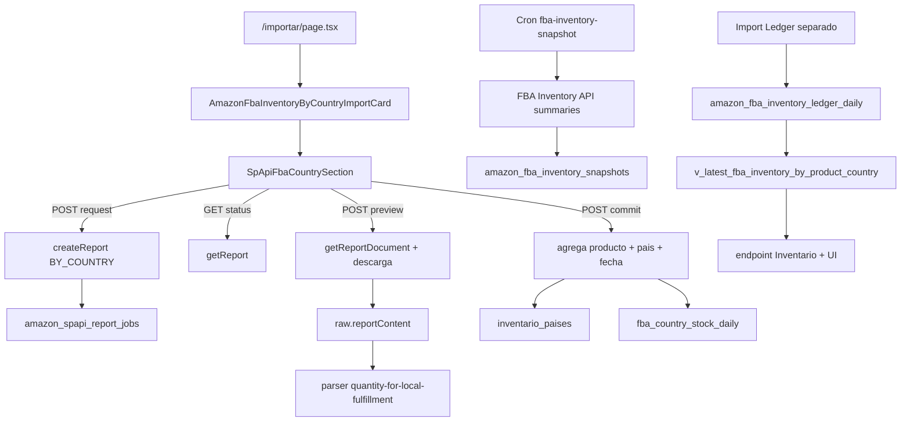

# Auditoria tecnica: actualizacion y visualizacion del stock FBA Amazon

Fecha de evidencia: 2026-07-31. Auditoria de solo lectura. No se ejecuto ningun endpoint, importacion, cron o llamada SP-API; no se altero la base de datos y no se hicieron commits. Se audita el working tree actual, que contiene cambios previos no confirmados, y se separa expresamente del estado historico que produjo `FBA: 466`.

## 1. Resumen ejecutivo

Hay tres fuentes con semanticas y fechas distintas:

- El boton manual solicita `GET_AFN_INVENTORY_DATA_BY_COUNTRY`. El parser suma `quantity-for-local-fulfillment` por SKU limpio y pais. Para Carly convierte dos Seller SKU distintos con el mismo FNSKU/ASIN en el mismo SKU limpio y suma ambas filas.
- `inventario_paises` conserva paises ausentes de un report posterior. El 2026-07-15 recibio 465 y con 1 IT residual llego exactamente a 466.
- La UI de detalle por pais usa Inventory Ledger, no BY_COUNTRY. Su ultimo dia sigue siendo 2026-06-16: Carly = GB 79 + DE 103 = 182 vendibles.

El ultimo job actual ya no es el que genero 466. Es del 2026-07-21, termino, se descargo e importo; dejo Carly en 858 dentro de `inventario_paises` (GB 302 + DE 418 + FR 136 + PL 1 + IT residual 1). Ninguna capa actual consultada devuelve 466.

Ademas, el working tree actual de `buildProductSummary` prioriza Ledger si existen filas Ledger por pais (`modules/inventory/services/buildInventoryProduct.ts:128-163`). Por ello este codigo construiria 182 para Carly. Si una aplicacion desplegada muestra 466, esta ejecutando una version anterior, conserva estado React anterior o no ha vuelto a consultar.

## 2. Flujo actual



## 3. Boton real de `/importar`

`app/[locale]/(dashboard)/importar/page.tsx:7-23` solo monta All Orders, Ledger y Multi-Country. El control SP-API real es `modules/imports/components/SpApiFbaCountrySection.tsx:16`.

| Texto | Handler real | Peticion | Resultado local |
|---|---|---|---|
| Solicitar informe FBA por pais | callback de `runAction` (`:75-95`) | `POST /api/amazon/sp-api/reports/fba-country/request`, sin body | guarda job y mensaje |
| Comprobar estado | `runAction` (`:99-119`) | `GET /api/amazon/sp-api/reports/{jobId}/status` | sustituye job |
| Descargar vista previa | `runAction` (`:122-145`) | `POST /api/amazon/sp-api/reports/{jobId}/preview` | guarda preview |
| Importar a stock por pais | `runAction` (`:148-165`) | `POST /api/amazon/sp-api/reports/{jobId}/commit` | muestra `commitMessage` |

No hay polling, encadenamiento automatico, navegacion, invalidacion ni refetch de Inventario. La primera accion es categoria **A: solo solicita el reporte**. Solicitar, comprobar, descargar e importar son cuatro acciones manuales distintas.

## 4. `fba-inventory-snapshot/*`

Solo existe `app/api/cron/amazon/fba-inventory-snapshot/route.ts`:

- Metodo: `POST` (`:57`). Autenticacion: `Authorization: Bearer CRON_SECRET`; rechaza secreto ausente o incorrecto (`:57-73`).
- Valida configuracion y llama `importFbaInventorySnapshotFromSpApi({})` (`:75-111`). No admite body funcional.
- Fuente: FBA Inventory API `GET /fba/inventory/v1/summaries`, `details=true`, `granularityType=Marketplace`, `granularityId` y `marketplaceIds` por marketplace (`fbaForecastSpApiImportsService.ts:676-697`).
- Persiste `fulfillable_quantity`, reserved, inbound, unfulfillable y researching en `amazon_fba_inventory_snapshots`, `source=spapi_fba_inventory_summaries` (`:704-748`). Es snapshot operativo directo; no usa Reports, Ledger, vistas ni `inventario_paises`.
- El job tecnico esta en ERROR desde `2026-07-03T08:54:47.07Z`, sin exito, por cuota excedida. No hay snapshots para los dos productos auditados.

Aqui snapshot significa una captura obtenida de `getInventorySummaries`, no una suma historica.

## 5. `app/api/cron/amazon/reports/*`

Todos exigen secreto cron y el scheduler habilitado. Los cinco endpoints son:

- `request-due`: pide los schedules vencidos mediante `requestDueAmazonReportSchedules`.
- `poll`: consulta jobs pendientes con `getReport` y actualiza `processing_status`, finalizacion y `report_document_id`.
- `preview`: descarga documentos DONE y guarda `raw.reportContent` mas resumen parseado.
- `commit`: exige `jobId`, preview valido y hace la persistencia autorizada.
- `run`: en el working tree actual ejecuta `poll -> preview -> commit -> requestDue -> readyToCommit` (`amazonReportSchedulerService.ts:788-793`). Puede importar automaticamente.

El boton manual no llama a estas rutas cron: usa las rutas `/api/amazon/sp-api/reports/...`. Ambas familias reutilizan `fbaCountryReportService`, `reportsClient`, `reportJobsRepository`, parser y repositorio. El flujo relevante es BY_COUNTRY; otros reports son contexto y no explican el clic.

## 6. ReportType y payload exacto

`FBA_COUNTRY_REPORT_TYPE` es `GET_AFN_INVENTORY_DATA_BY_COUNTRY` (`modules/amazon-sp-api/config.ts:107`). `requestFbaCountryReportJob` forma (`fbaCountryReportService.ts:48-88`):

```json
{
  "reportType": "GET_AFN_INVENTORY_DATA_BY_COUNTRY",
  "marketplaceIds": [
    "A1RKKUPIHCS9HS", "A13V1IB3VIYZZH", "A1PA6795UKMFR9",
    "APJ6JRA9NG5V4", "A1F83G8C2ARO7P", "A1C3SOZRARQ6R3",
    "A2NODRKZP88ZB9"
  ]
}
```

`reportsClient.ts:19-23` solo agrega fechas/opciones si existen. Este flujo no envia `dataStartTime`, `dataEndTime`, `reportOptions`, `aggregateByLocation` ni `aggregatedByTimePeriod`. No es Ledger Summary ni Detail; es una fotografia near-real-time BY_COUNTRY. Amazon devolvio inicio y fin iguales al instante de creacion.

## 7. Ultima peticion real

Consulta SELECT a `amazon_spapi_report_jobs`:

| Campo | Valor |
|---|---|
| id | `a9a53bcf-b054-457e-a0b8-731a15dce6f0` |
| reportId | `1273135020655` |
| reportDocumentId | `amzn1.spdoc.1.4.eu.d131d8de-f574-4b27-812d-d45b2cf46fd8.T1IQGAGRL6199X.2100` |
| source | `amazon_spapi` |
| requested_at | `2026-07-21T11:09:47.276155Z` |
| processingStart/End | `11:09:57Z` / `11:10:09Z` |
| completed_at | `2026-07-21T11:10:42.136Z` |
| downloaded_at | `2026-07-21T11:10:47.744Z` |
| importedAt | `2026-07-21T11:11:03.533Z` |
| status / Amazon status | `IMPORTED` / `DONE` |
| filas | 162 totales, 110 validas/importables |
| upserts | 73 historicos + 73 `inventario_paises` |
| warnings/unmatched/error | 0 / 0 / null |

La tabla real no tiene `error_code`, `imported_at`, `rows_imported` ni `retry_count`; importacion/recuentos viven en `raw` y no existe contador persistido de reintentos. La peticion termino, se descargo e importo. No quedo bloqueada por guard ni pendiente del cron.

## 8. Documento crudo Amazon

El texto UTF-8 se guarda completo en `raw.reportContent`; es TSV. Cabecera exacta:

```text
seller-sku	fulfillment-channel-sku	asin	condition-type	country	quantity-for-local-fulfillment
```

Ultimo documento: 163 lineas no vacias (cabecera + 162 filas). Filas completas de Carly:

```text
UK8436616610302	B0FL7TFQG1	B0FL7TFQG1	NewItem	GB	151
amzn.gr.8436616610302-3UcVMP2DqRvNDmC-LN	X002IKXWV7	B0FL7TFQG1	UsedLikeNew	PL	1
UK8436616610302	B0FL7TFQG1	B0FL7TFQG1	NewItem	FR	68
UK8436616610302	B0FL7TFQG1	B0FL7TFQG1	NewItem	DE	209
f8436616610302	B0FL7TFQG1	B0FL7TFQG1	NewItem	GB	151
f8436616610302	B0FL7TFQG1	B0FL7TFQG1	NewItem	FR	68
f8436616610302	B0FL7TFQG1	B0FL7TFQG1	NewItem	DE	209
```

Amazon no devuelve 79 en este report: devuelve 857 al sumar esas filas. El documento del 15 de julio que explica 466 devolvia GB 155 dos veces, DE 9 dos veces, FR 68 dos veces y PL 1: 465.

## 9. Parser y trazabilidad

Parser: `modules/imports/amazon-fba-inventory-by-country/parser.ts`.

- Normaliza cabeceras; acepta Seller SKU/MSKU/FNSKU (`:59-96`). Extrae SKU limpio con `extractTwinlySkuFromSellerSku` (`:149`).
- Pais viene de la columna `country`; `resolveCountryFromValue` normaliza `UK -> GB` (`mappers.ts:21-24`). No usa marketplace, listing ni pais de entrega.
- Cantidad: primera cabecera disponible de la lista que comienza por `quantity-for-local-fulfillment` (`parser.ts:79-96,174-183`). Vacio/no numerico pasa a 0 y negativos se fijan a 0.
- Fecha: `new Date().toISOString().slice(0,10)` (`:115`), fecha de parseo, no una fecha contenida en el archivo.

Trazabilidad ultimo documento:

```text
UK843... GB 151 -> {skuLimpio:8436616610302,pais:GB,stockFba:151}
f843...  GB 151 -> {skuLimpio:8436616610302,pais:GB,stockFba:151}
objeto persistido -> GB 302

UK843... DE 209 + f843... DE 209 -> DE 418
UK843... FR 68  + f843... FR 68  -> FR 136
fila UsedLikeNew PL 1             -> PL 1
```

No suma saldos ni movimientos Ledger. Suma filas distintas que colapsan al mismo `producto_id + pais + snapshotDate`.

## 10. Persistencia e idempotencia

- `amazon_spapi_report_jobs`: job, estado, documento y resumen. `report_id` identifica Amazon y `report_document_id` el documento.
- `inventario_paises`: `upsert` por `producto_id,pais` (`repository.ts:288-312`); actualiza stock FBA/marketplace/fecha. No elimina paises ausentes.
- `fba_country_stock_daily`: `upsert` por `producto_id,sku_limpio,marketplace_country,snapshot_date,source` (`:321-345`). Guarda el agregado y `raw.sources`.
- Ledger separado: `amazon_fba_inventory_ledger_daily`; la vista suma `ending_warehouse_balance` SELLABLE.
- Snapshot API separado: `amazon_fba_inventory_snapshots`.

Reprocesar el mismo documento el mismo dia sobrescribe las mismas claves y no duplica el agregado. Reprocesarlo otro dia crea otro historico y vuelve a sobrescribir el actual. Un pais desaparecido no se pone a cero: queda residual.

## 11. Evidencia y reconstruccion de 466

| Capa/fecha | GB | DE | FR | IT | PL | Total |
|---|---:|---:|---:|---:|---:|---:|
| Amazon crudo 2026-07-15 | 310 | 18 | 136 | 0 | 1 | 465 |
| Parser/preparado 2026-07-15 | 310 | 18 | 136 | 0 | 1 | 465 |
| `inventario_paises` tras ese commit | 310 | 18 | 136 | 1 residual | 1 | **466** |
| Amazon/parser 2026-07-21 | 302 | 418 | 136 | 0 | 1 | 857 |
| `inventario_paises` actual | 302 | 418 | 136 | 1 residual | 1 | 858 |
| Ledger/view/RPC actual | 79 | 103 | 0 | 0 | 0 | 182 |
| endpoint/UI con working tree actual | 79 | 103 | 0 | 0 | 0 | 182 |

`466 = 310 GB + 18 DE + 136 FR + 1 PL + 1 IT residual`. Aparece por primera vez en `inventario_paises`, no en Amazon ni parser. Hoy ninguna capa devuelve 466.

## 12. Vista, endpoint y frontend

- `v_latest_fba_inventory_by_product_country` elige `MAX(snapshot_date)` por producto, despues agrupa `location` como pais y disposiciones (`sql/migrations/20260714_create_latest_fba_inventory_by_product_country.sql:4-68`).
- `fetchLatestFbaInventoryByProductCountry` lee esa vista (`inventoryRepository.ts:1719-1768`).
- `loadInventoryContextForProduct` la carga para el detalle (`loadInventoryContext.ts:299-303`).
- `buildCountryRowsForProduct` entrega sellable, unsellable, total y fecha (`buildInventoryProduct.ts:42-115`).
- `GET /api/inventory/product/[id]` construye el detalle. `InventoryPage` muestra fuente y ultimo snapshot (`InventoryPage.tsx:1343-1360,1657-1672`).
- En el working tree, `buildProductSummary` suma Ledger si existe; el estado anterior usaba `v_stock_seguridad_sugerido`/`inventario_paises` para el total y Ledger para el desglose.

No se detecta join multiplicador ni suma adicional frontend. La incoherencia proviene de seleccionar fuentes diferentes, fechas diferentes y, en BY_COUNTRY, sumar identidades colapsadas.

## 13. Pais y fecha 2026-06-16

BY_COUNTRY conserva `country`; parser normaliza UK/GB; persistencia usa `pais`. Ledger usa `location` con `location_country` de apoyo. UI usa el `pais` de la vista Ledger. No sustituye pais fisico por marketplace en estas rutas.

La secuencia de fecha es:

1. BY_COUNTRY actual: peticion/documento/importacion 2026-07-21; parser guarda 2026-07-21.
2. Ledger: el ultimo `snapshot_date` contenido/persistido es 2026-06-16; fue importado 2026-06-17.
3. La vista toma MAX por producto = 2026-06-16.
4. Repositorio, endpoint y componente propagan literalmente esa fecha.

No es cache, fecha de job BY_COUNTRY ni fecha global de otro producto. Es el ultimo dia del Ledger obsoleto, 45 dias stale en la consulta del 31 de julio.

## 14. Refresco tras el boton

Tras request solo cambia el estado local del job. No espera Amazon ni ejecuta status/preview/commit. Tras commit solo muestra mensaje. No refresca Inventario.

Los fetch de Inventario usan `cache: "no-store"` (`InventoryPage.tsx:320,361,532,577`), pero eso solo evita reutilizar respuesta cuando hay una peticion: no provoca una peticion nueva. La UI puede mantener el dato cargado hasta refetch/remontaje. Aun refetchando, seguira mostrando 2026-06-16 porque el BY_COUNTRY no actualiza Ledger.

## 15. Caso Alaia

Producto: `8436616610104`, ALAIA - GRIS. Ultimo crudo:

```text
f8436616610104	X00259GEWP	B0DJBQGKBT	NewItem	GB	153
f8436616610104UK	B0DJBQGKBT	B0DJBQGKBT	NewItem	GB	213
f8436616610104	X00259GEWP	B0DJBQGKBT	NewItem	DE	287
```

Parser/importador: GB 366, DE 287. `inventario_paises`: GB 366 + DE 287 + ES residual 3 + FR residual 7 + PL residual 1 = 664. Ledger/UI del 2026-06-16: GB 223 + DE 593 = 816 sellable; ES/IT solo no apto. La distribucion cambia al seleccionar Ledger y ya venia inflada en BY_COUNTRY por colapso de Seller SKU en GB.

## 16. Comparacion de fuentes Amazon

| Fuente | Concepto/frescura | Granularidad | Identificadores | Riesgo principal |
|---|---|---|---|---|
| FBA Inventory API `getInventorySummaries` | disponibilidad casi real-time; fulfillable/reserved/inbound/unfulfillable | marketplace, no pais fisico | sellerSku, fnSku, asin | confundir marketplace con ubicacion fisica |
| `GET_AFN_INVENTORY_DATA_BY_COUNTRY` | disponible para fulfillment local, near-real-time | pais | seller-sku, FNSKU, ASIN | sumar listings/identidades equivalentes sin regla de negocio |
| `GET_LEDGER_SUMMARY_VIEW_DATA` | reconciliacion de saldo inicial, movimientos y final | COUNTRY/FC; DAILY/WEEKLY/MONTHLY | MSKU, FNSKU, ASIN | usar periodo viejo o movimientos como stock |
| Fuente actual del boton | BY_COUNTRY sin opciones | pais | seller-sku, FNSKU, ASIN | parser suma por SKU limpio y no limpia paises ausentes |

Para stock FBA vendible actual total, Inventory API es la fuente conceptualmente mas directa. Para ubicacion fisica por pais, BY_COUNTRY es pertinente, pero el consumo actual no es fiable hasta definir identidad y reemplazo completo del snapshot. Ledger es adecuado para reconciliacion/historico, no como actualidad si no se importa con frecuencia.

Fuentes oficiales: [FBA Inventory API](https://developer-docs.amazon.com/sp-api/docs/fba-inventory-api-v1-use-case-guide), [tipos de reports FBA](https://developer-docs.amazon.com/sp-api/lang-en_EN/docs/report-type-values-fba), [Multi-Country Inventory](https://sellercentral.amazon.fr/help/hub/reference/external/G201491370?mons_sel_locale=en_FR&pageName=FR%3ASC%3ATrim-help%2Fhub%2Freference%2Fexternal%2FG201491370).

## 17. Comparacion prudente con Shopkeeper

No se afirma conocer su backend privado ni su fuente. Solo cabe observar su presentacion de inventario y busqueda/agrupacion de productos Amazon. Hipotesis tecnica, no afirmacion sobre Shopkeeper: una solucion equivalente podria combinar Inventory API para disponibilidad actual y BY_COUNTRY/Ledger para ubicacion, mostrando fuente y frescura y resolviendo MSKU/FNSKU/ASIN sin colapsos silenciosos.

## 18. Errores priorizados

1. Critico: BY_COUNTRY suma Seller SKU distintos que resuelven al mismo producto/pais; no se propone dedupe automatico porque podria eliminar listings reales.
2. Critico: `inventario_paises` no elimina/pone a cero paises ausentes; genera residuos.
3. Alto: la version que produjo 466 mezclaba total BY_COUNTRY con desglose Ledger. El working tree intenta alinear a Ledger, pero Ledger esta obsoleto y el cambio no esta confirmado/desplegado.
4. Alto: el cron de snapshot operativo no tiene ningun exito y esta bloqueado por cuota.
5. Alto: Ledger no se actualiza desde 2026-06-16.
6. Medio: boton sin polling, encadenamiento ni refetch.
7. Medio: fecha BY_COUNTRY es fecha local de parseo, no metadato Amazon.
8. Medio: jobs no persisten retry count ni columnas normalizadas de importacion.

## 19. Archivos candidatos para una segunda fase

Sin modificar ahora: `parser.ts`, `repository.ts` y `service.ts` de `amazon-fba-inventory-by-country`; `SpApiFbaCountrySection.tsx`; `fbaCountryReportService.ts`; `amazonReportSchedulerService.ts`; `buildInventoryProduct.ts`; `resolveOperationalStock.ts`; `InventoryPage.tsx`; migracion de `v_latest_fba_inventory_by_product_country`; y, si se aprueba, una migracion nueva para una fuente canonica consistente.

## 20. Respuestas de cierre

1. Handler: callbacks `runAction` de `SpApiFbaCountrySection`.
2. Endpoint inicial: `POST /api/amazon/sp-api/reports/fba-country/request`.
3. Snapshot cron: llama FBA Inventory API y escribe `amazon_fba_inventory_snapshots`.
4. Reports implicado: request/status/preview/commit manual; los cron reutilizan el mismo servicio.
5. ReportType: `GET_AFN_INVENTORY_DATA_BY_COUNTRY`.
6. Payload: `reportType + 7 marketplaceIds`, sin fechas/opciones.
7. Ultima peticion: DONE/IMPORTED.
8. Documento: descargado y guardado.
9. Importacion: completada, 73 + 73 upserts.
10. Amazon ultimo para Carly: GB 151+151, DE 209+209, FR 68+68, PL 1.
11. No devuelve 79; devuelve 857 en el ultimo BY_COUNTRY. 79 es GB Ledger antiguo.
12. Parser: `quantity-for-local-fulfillment`.
13. Guarda agregado en `inventario_paises` y `fba_country_stock_daily`.
14. 466 aparecio primero en `inventario_paises` historico.
15. 466 = 310 + 18 + 136 + 1 + 1 residual.
16. Pais se estropea en agregacion BY_COUNTRY y vuelve a divergir al seleccionar Ledger en UI.
17. 2026-06-16 es MAX Ledger del producto.
18. Frontend no refresca tras solicitar/importar.
19. Alaia: BY_COUNTRY actual 653, tabla 664 con residuos, Ledger/UI 816.
20. La fuente BY_COUNTRY es pertinente para pais, pero su uso actual no es adecuado sin identidad canonica, reemplazo completo y frescura; Ledger obsoleto tampoco es adecuado como stock actual.
